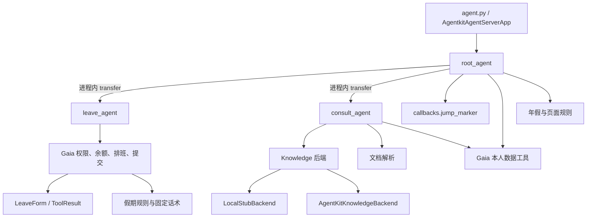

# HR Agent 当前事实基线

冻结时间：2026-08-09（Asia/Shanghai）
适用提交：`813ec1f6b50cec7d717737e368bd7646d58d7850`

本文是 A2A 拆分批次 0 的可回归起点，只记录本次从代码、Git、测试和只读外部调用得到的事实。密钥值、认证头、Gaia JWT、员工敏感数据和知识正文不进入本文。

## 1. Git 与文件安全

| 检查项 | 结果 | 证据 |
|---|---|---|
| 仓库 | `/Users/sunshine/IdeaProjects/人力agent/hr-agent` | `git rev-parse --show-toplevel` |
| 分支 | `main` | `git branch --show-current` |
| HEAD | `813ec1f6b50cec7d717737e368bd7646d58d7850` | `git rev-parse HEAD` |
| 用户未提交文件 | `docs/hr-agent-a2a-split-plan.md`，未修改、未暂存 | `git status --short --branch` |
| 当前敏感文件 | `.env`、`.venv/`、`agentkit.yaml` 均被忽略 | `git status --short --ignored`、`.gitignore` |
| 当前已跟踪安全模板 | 仅 `.env.example` | `git ls-files` |
| 压缩包 | 工作区未发现 `zip/tar/tgz/gz/7z` | `find` 文件名检查 |
| Git 历史敏感路径 | 未发现 `.env`、`agentkit.yaml`、压缩包、日志或 `.venv` 曾被跟踪 | `git log --all --name-status -- <路径模式>` |
| Git 历史凭据扫描 | 300 个历史 blob 未发现真实密钥赋值或常见 AK、模型 Key、Bearer JWT、私钥前缀 | 全历史 blob 内容扫描；仅输出文件、键名和脱敏结果 |

当前真实 `agentkit.yaml` 仍含 Runtime 配置和凭据，因此继续保持忽略，不作为迁移模板提交。批次 6 前须先轮换现有 Runtime API Key：本次审计工具的第一版脱敏规则未覆盖 `runtime_apikey` 字段名，导致该值进入了本地 Codex 工具记录。本文不记录该值，且批次 0 不执行任何云端轮换或写操作。

## 2. 第 3 章基线核对

| 冻结方案事实 | 当前代码事实 | 判断 |
|---|---|---|
| 服务入口 `agent.py` | `agent.py` 创建 `AgentkitAgentServerApp` 并监听 `0.0.0.0:8000` | 一致 |
| 根 Agent 为 `root_agent` | `hr_agent/agents/main_agent.py` 中内部名为 `root_agent` | 一致 |
| 本地短期记忆 | `ShortTermMemory(backend="local")`，实际 session service 为 `InMemorySessionService` | 一致 |
| ADK 会话接口与 `/run_sse` | 本地路由表和 HTTP 实测均存在 | 一致 |
| 四个业务变量通过 `session.state` 注入 | `employeeId`、`corp_id`、`client_secret`、`grant_type` 由客户端创建会话时写入 state | 一致，但密钥进入会话状态是后续必须消除的风险 |
| `main_agent.py` 负责入口、本人查询、跳页和固定交互 | 根 Agent 直接装配本人数据工具和 `page_jump` | 一致 |
| `consult_agent.py` 同时含咨询与本人数据兜底 | 咨询 Agent 装配 2 个咨询工具和 3 个本人数据工具 | 一致 |
| `leave_agent.py` 负责请假多轮与提交骨架 | 本地子 Agent 装配权限、余额、排班、提交工具 | 一致 |
| Python 3.12 | 本地为 Python 3.12.13 | 一致 |
| AgentKit 0.5.10 / veADK 0.5.37 / google-adk 1.32.0 | 本地已安装版本与 `pyproject.toml` 一致 | 一致 |
| 21 条评测 | YAML 实际为 21 条，pytest 收集 21 条 | 一致；`cases.yaml` 与部分旧注释仍写“22 条”，属于文案偏差 |

不影响冻结边界的补充事实：

- 当前三个 Agent 都使用 `doubao-seed-1.6-250615`，thinking（思考模式）默认 `disabled`；本轮不得自行改变。
- `AgentkitAgentServerApp` 0.5.10 已把根 Agent 挂载为 A2A 服务，但当前业务分流仍是单进程 `sub_agents` transfer，没有 A2A 空间注册、发现和跨 Runtime 调用。
- 当前云端是北京 `key_auth` 的单个 Basic App Runtime；真实资源配置仅保存在被忽略的 `agentkit.yaml`，现有线上资源不在批次 0 修改范围。

## 3. 当前运行结构与模块依赖



关键依赖边：

- `agent -> hr_agent.agents.main_agent`
- `main_agent -> leave_agent, consult_agent, model_config, prompts, jump_marker, constants, Gaia 查询, rules`
- `consult_agent -> Knowledge/文档工具 + Gaia 本人数据工具`
- `leave_agent -> Gaia 权限/余额/排班/提交工具`
- `Gaia submit -> constants + schemas + Gaia 查询 + leave_dates`
- `kb_search -> knowledge.backend -> local_stub | agentkit_backend`

当前没有 `apps/` 或 `packages/hr_domain/`，所有 Agent 与领域实现仍在 `hr_agent/` 下。批次 2 才允许移动目录。

## 4. 当前 Agent 与工具装配

| Agent | 模型 | 工具 | 子 Agent / 回调 |
|---|---|---|---|
| `root_agent` | `doubao-seed-1.6-250615` | `page_jump`、`get_leave_balance`、`get_medical_period`、`calc_annual_leave` | `leave_agent`、`consult_agent`；`jump_marker_callback` |
| `leave_agent` | 同上 | `get_leave_permissions`、`get_leave_balance`、`get_schedule`、`submit_leave` | 无 |
| `consult_agent` | 同上 | `kb_search`、`parse_document`、`get_leave_balance`、`get_medical_period`、`calc_annual_leave` | 无 |

与目标职责直接相关的待迁移事实：

- Orchestrator 当前直接查询本人数据，批次 5 完成后生产路径必须移除。
- Consult 当前直接查询本人数据，批次 4/5 完成后必须移出咨询职责。
- Leave 当前保持本地，不得在本轮拆分，也不得改成逐项 A2A 查询校验数据。
- `page_jump` 与 JUMP 回调只属于 Orchestrator。

## 5. Knowledge 与 Gaia 基线

### 5.1 Knowledge

`KB_BACKEND=agentkit` 由本地 `.env` 在测试进程中加载。本次只读查询确认四个 scope 都可返回 `content/source/score`。下表保留来源、score、正文长度和正文 SHA-256 前 16 位，不写正文。

| scope | top1 来源 | top1 score | 正文长度 | 正文摘要 |
|---|---|---:|---:|---|
| `policy` | `华润啤酒考勤休假管理制度-华啤 A03-24-人力 26C.docx` | 0.2240487337 | 2037 | `1e40acfd7195a34a` |
| `handbook` | `考勤管理系统操作手册-0721.docx` | 0.3729049563 | 2009 | `6f9882009fb0c7f9` |
| `salary` | `华润啤酒员工福利管理制度_华啤A03-20-人力24B.docx` | 0.2647742033 | 2040 | `3f4ca2b520eff44f` |
| `childcare` | `各省市地方假期政策20260629.xlsx` | 0.4266201258 | 114 | `52c8e1eea03f26b7` |

当前实现存在两个冻结方案已经预判的问题：

1. `hr_agent/knowledge/agentkit_backend.py` 直接访问 `kb._backend`、`backend._viking_sdk_client` 和 `backend._search_knowledge()` 私有成员；批次 1 必须改为官方公开接口。
2. 单库失败被 `except Exception: continue` 吞掉；指定单库失败会表现为成功空列表，`all` 部分失败也不会返回失败 scope。

相关度阈值尚未冻结。本次只记录分布，不从上述单次 score 主观设置阈值。

### 5.2 Gaia

- 21 条评测通过 monkeypatch 使用固定 Gaia 响应，未调用真实 Gaia。
- 当前 `from_state()` 每次创建新 `GaiaClient`，JWT cache（缓存）仅在单个实例内有效，不能跨工具调用稳定复用。
- `client_secret` 与 `grant_type` 当前从 session state 读取；目标 Runtime 必须改为服务端配置，禁止进入 A2A 消息。
- 真实 Gaia 鉴权、员工数据与只读调用：**未验证**。

## 6. HTTP、会话、SSE 与 JUMP 基线

本次从 `agent.py` 启动本地服务后执行了真实 HTTP 验证：

| 检查 | 结果 |
|---|---|
| `GET /health` | HTTP 200，`{"status":"ok"}` |
| 创建会话 | `POST /apps/root_agent/users/{user_id}/sessions/{session_id}` 成功 |
| `POST /run_sse` | HTTP 200，返回 13 个 SSE event（事件） |
| 事件顶层字段 | `actions`、`author`、`content`、`finishReason`、`id`、`invocationId`、`longRunningToolIds`、`modelVersion`、`partial`、`timestamp`、`usageMetadata` |
| part 类型 | `functionCall`、`functionResponse`、`text` |
| JUMP | “打开打卡明细”最终文本包含 `[[JUMP:punch-details]]` |
| SSE 错误事件 | 0 |

当前会话底层为 `InMemorySessionService`。进程重启和多实例之间不会共享状态，本批不把它描述为可靠持久会话。

## 7. 测试与评测基线

### 7.1 非评测测试

命令：

```bash
.venv/bin/pytest -q
```

结果：`94 passed, 21 deselected in 1.14s`。

### 7.2 21 条对话评测

命令：

```bash
.venv/bin/pytest -m eval -v
```

结果：`21 passed, 94 deselected, 1 warning in 143.17s`。

执行组成：

- 模型：真实方舟模型；
- Knowledge：真实 AgentKit/Viking Knowledge；
- Gaia：测试 Stub；
- 文档下载：测试 Stub；
- 逐用例工具调用、回答、耗时和错误：`tests/eval/logs/eval-20260809-143943.log`（被 Git 忽略，不提交）。

唯一 warning（警告）：veADK 0.5.37 的 `VikingDBKnowledgeBackend` 字段名 `schema` 覆盖父类属性。

### 7.3 固定归属

| 目标归属 | 用例 |
|---|---|
| Orchestrator | `page_jump_punch`、`cancel_leave`、`handoff` |
| 本地 Leave Agent | `quick_tomorrow`、`missing_type_asks`、`multi_type_rejected`、`gender_mismatch`、`rest_day` |
| Employee Data Agent | `balance_query`、`annual_calc`、`personal_data_not_kb` |
| Consult Agent | `consult_transfer`、`policy_late_fine`、`non_hr_rejected`、`childcare_sichuan`、`childcare_asks_province`、`salary_term_alias`、`kb_empty_honest`、`doc_qa`、`followup_present`、`policy_probation` |

评测数量和断言在后续批次不得减少或放宽。

## 8. 批次 0 外部验证边界

| 项目 | 状态 | 说明 |
|---|---|---|
| 真实模型 | 已验证 | 21 条评测实际调用 |
| 真实 AgentKit/Viking Knowledge | 已验证 | 21 条评测及四 scope 只读快照 |
| 真实 Gaia | 未验证 | 评测使用 Stub，未配置可验证员工凭据 |
| 当前线上 `hr-agent` | 未在本批重验 | 仅核对本地被忽略配置与已有部署文档；未调用线上 Runtime |
| A2A 空间、注册、跨 Runtime Trace | 未验证 | 尚未实施，禁止用本地子 Agent transfer 代替 |
| Runtime 重启恢复、多实例一致性 | 未验证 | 当前明确为本地内存会话 |

## 9. 进入批次 1 的已知风险

1. 目标依赖能否共同解析尚未验证；必须先读取目标包的正式依赖元数据。
2. Knowledge 当前依赖 SDK 私有成员；若目标版本公开接口不能同时保留 `content/source/score`，批次 1 必须停止并提交能力差异。
3. `agentkit.yaml` 含现有云资源和凭据，不得加入 Git；现有 Runtime API Key 在批次 6 获批前不得云端轮换，但部署前必须轮换。
4. `client_secret` 当前进入 session state；拆分时必须过滤，不能透传 A2A。
5. 当前日期在 Agent 模块导入时冻结；冻结方案要求新增测试并修正，但不得改变请假业务话术。
6. 真实 Gaia、持久会话、多实例和跨 Runtime Trace 暂无证据，后续只能标记“未验证”，不能由 Stub 代替。
